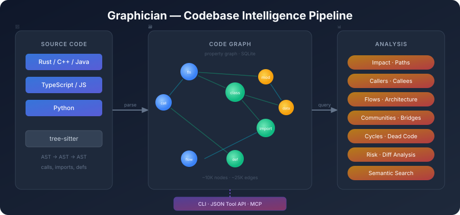

# Graphician

A **local-first code graph** for navigating, reviewing, and reasoning about a codebase.

Graphician parses source code across multiple languages, builds a typed property graph, and exposes 40+ operations for structural analysis — all running locally with no external dependencies required.

## Pipeline



Source code is parsed by tree-sitter into an AST, assembled into a property graph (~10K nodes, ~25K edges), and exposed through a CLI or JSON tool API for structural analysis.

## Features

- **Multi-language parsing** — C/C++, Rust, Java, TypeScript, JavaScript, Python (via tree-sitter)
- **Code graph** — nodes for functions, classes, modules, calls, imports, data flows, and more
- **Structural analysis** — call graphs, data flows, communities, centrality, cycles, bridges, dead code
- **Change analysis** — git-aware diff detection, risk scoring, affected flows, test coverage gaps
- **Semantic search** — BM25 + embedding-based search with reciprocal rank fusion
- **Embeddings** — local sentence-transformers or external API backends
- **Pattern detection** — framework-level patterns (React, Spring DI, SQLAlchemy, FastAPI, etc.)
- **CLI & tool interface** — structured JSON commands for scripting and agent integration
- **Graph watcher** — incremental rebuilds on file changes

## Installation

```bash
pip install graphician
```

### Optional extras

| Extra | Adds |
|-------|------|
| `embeddings` | Local embedding model (`sentence-transformers`) |
| `jedi` | Jedi-based Python call enrichment |
| `dev` | Test and lint tooling |

```bash
pip install graphician[embeddings,jedi,dev]
```

## Quick Start

### Build a graph

```bash
graphician build /path/to/project
```

### Inspect the result

```bash
graphician status
graphician flows --top 10
graphician communities
graphician god-nodes --top 10
```

### Search and analyze

```bash
# Semantic search
graphician search "authentication" --detail standard

# Impact analysis
graphician impact "src/auth.rs::User"

# Caller / callee chains
graphician callers "login"
graphician callees "render"

# Execution paths
graphician paths "main" "process_payment"

# Extraction, call-resolution, connectivity, and test-link coverage
graphician coverage
```

### Review changes

```bash
# Detect what changed since a revision
graphician detect-changes --base HEAD~3

# Risk score for a symbol
graphician risk "src/payment.py::charge"

# Test coverage gaps
graphician test-coverage
```

### Tool interface (JSON)

```bash
graphician tool --operation minimal_context --target "src/main.rs::App" --detail minimal
```

## CLI Reference

| Subcommand | Description |
|------------|-------------|
| `build` | Full extraction and graph build |
| `update` | Incremental update from last build |
| `status` | Graph statistics (nodes, edges, call resolution) |
| `coverage` | Graph extraction and relationship coverage |
| `search` | Hybrid semantic + keyword search |
| `tool` | Generic tool operation interface |
| `impact` | Symbol change blast radius |
| `paths` | Execution paths between two symbols |
| `callers` / `callees` | Caller / callee chains |
| `flows` | Ranked execution flows |
| `architecture` | Communities, coupling, bottlenecks |
| `communities` | Community detection (Louvain, Leiden, Infomap) |
| `bridge-nodes` | Chokepoint / bridge nodes |
| `god-nodes` | Highest PageRank hub nodes |
| `cycles` | Dependency cycles |
| `articulation` | Articulation points |
| `large-functions` | Oversized functions |
| `dead-code` | Unreachable symbols |
| `detect-changes` | Diff-aware change detection |
| `risk` | Change risk scoring |
| `test-coverage` | Test coverage gaps |
| `graph-diff` | Graph-level diff |
| `snapshot-diff` | Snapshot comparison |
| `embed` | Build local embeddings |
| `embed-external` | Fetch embeddings from external API |
| `rebuild-fts` | Rebuild full-text search index |
| `watch` | Watch mode — incremental rebuilds |

## Architecture

```
src/graphician/
├── analysis/          ← Structural analysis: impact, flows, communities, search, changes
│   ├── communities/   ← Louvain, Leiden, Infomap detection
│   ├── search/        ← BM25, fuzzy, fusion, vocabulary
│   ├── changes/       ← Git-aware diff, risk, coverage
│   └── dedup/         ← MinHash, LSH, union-find deduplication
├── core/              ← Graph, Node, Edge, EdgeId, NodeId
├── extraction/        ← Language parsers, pipeline, call resolution
│   ├── documents/     ← HTML, Markdown, SVG parsers
│   ├── languages/     ← tree-sitter language bindings
│   ├── patterns/      ← Framework pattern detection
│   └── flows/         ← Entry point discovery
├── interfaces/        ← CLI, MCP transport, daemon, watcher
└── persistence/       ← SQLite store, embeddings, FTS5 index
```

## Graph Stats

Typical output from `graphician status`:

```
Graph stats: 10218 nodes, 25741 edges

Call resolution
- Resolved: 2997, Unresolved: 1764, Rate: 62.9%
```

## Configuration

Graphician auto-discovers `ariadne.db` in the current directory. Store file path:

```bash
graphician build --db /custom/path/ariadne.db
```

## Development

```bash
# Install in editable mode
pip install -e ".[dev,embeddings,jedi]"

# Run tests
pytest

# Lint
ruff check

# Type check
mypy graphician
```

## Comparison: Graphician (Python) vs Ariadne (Rust)

Graphician is the Python port of the original [Ariadne Rust codebase](https://github.com/earendilworks/ariadne). Feature parity is approximately 91%:

| Area | Rust | Python |
|------|------|--------|
| Tool operations | 45 | 41 shared + 12 Python-specific |
| Analysis parity | — | ~95% |
| CLI parity | — | ~95% |
| Pattern catalog | 34 | 33 |

See [GAP_ANALYSIS.md](GAP_ANALYSIS.md) for a detailed comparison.

## License

Private / All rights reserved.
